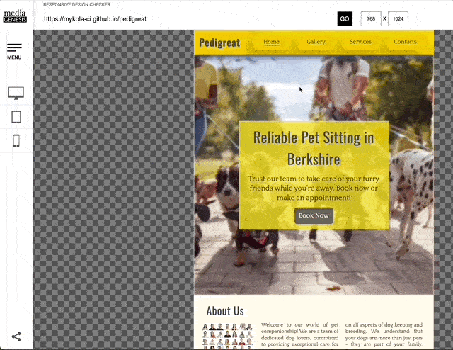

# Testing
[Back to Readme](README.md)

## Contents
* [Compatibility](#compatibility)
* [Responsiveness](#responsiveness)
* [Manual Testing](#testing-links-and-action-elements-table-summary)
* [Validator Testing](#validator-testing)
* [Lighthouse Report](#lighthouse-report)
* [Bugs Unfixed](#bugs-unfixed)

## Compatibility
[Back to Contents](#contents)

* The Pedigreat site was checked with Chrome, Safari and Firefox browsers
  - __Chrome__

  

  

  - __Safari__

  

  

  - __Firefox__

  

  

## Responsiveness
[Back to Contents](#contents)

* Web-pages were checked with the [Chrome DevTools](https://developer.chrome.com/docs/devtools/)

  - __Home Page__

  

  

  

  - __Gallery__

  

  - __Services__

  

  - __Contacts__

  

  - __Registration Form__

  

  - __Response Page__

  

   

-----

* Web-pages were additionally checked with Media Genesis' tool [Responsive Web Design Checker](https://responsivedesignchecker.com/)

  - __Desktops__

 

  - __Tablets__

 

  - __Mobiles__

## Testing Links and Action Elements (Table Summary)
[Back to Contents](#contents)

| __Feature__ | __Action__ | __Expected result__ | __Tested__ | __Comments__ |
| --- | --- | --- | --- | --- |
| __Navbar__ | | | | Available across all the pages | 
| Pedigreat | Click on the "Pedigreat" logo link | The user is redirected to the Home page | Yes | Tested from all pages |
| Home | Click on the "Home" link | The user is redirected to the Home page | Yes | Tested from all pages |
| Gallery | Click on the "Gallery" link | The user is redirected to the gallery page | Yes | Tested from all pages |
| Services | Click on the "Services" link | The user is redirected to the Services page | Yes | Tested on all pages |
| Contact | Click on the "Contact" link | The user is redirected to the Contact page | Yes | Tested from all pages |
| __Footer__ | | | | Available across all the pages |
| Facebook icon in the footer | Click on the Facebook icon | The user is redirected to the Facebook page | Yes | - |
| Twitter icon in the footer | Click on the Twitter icon | The user is redirected to the Twitter page | Yes | - |
| YouTube icon in the footer | Click on the YouTube icon | The user is redirected to the YouTube page | Yes | - |
| Instagram icon in the footer | Click on the Instagram icon | The user is redirected to the Instagram page | Yes | - |
| __Home page__ | | | | |
| "Book Now" button on the main banner | Click on the "Book Now" button | The user is redirected to the Contacts page | Yes | - |
| "Learn More" links in About Us section | Click on the "Learn More" link | The user is redirected to the Services page | Yes | - |
| "Learn More" links in Services section | Click on the "Learn More" button | The user is redirected to the Services page | Yes | Tested 4 links |
| __Services page__ | | | | |
| "Book Now" button in the Price Cards | Click on the "Book Now" button | The user is redirected to the Contacts page | Yes | Tested 4 buttons |
| __Contacts page__ | | | | | |
| "Go On Register Now" button | Click "Go On Register Now" button | User is redirected to the Customer Registration Form | Yes | - |
| __Registration Form page__ | | | | | |
| "First Name" input | Key in the first name | the name is displayed | Yes | required |
| "Last Name" input | Key in the last name | the name is displayed | Yes | required |
| "Mobile Number" input | Key in the number | the number is displayed | Yes | optional  |
| "E-Mail" input | Key in the e-mail| e-mail is displayed | Yes | required. If '@' is missing the popup appears 'please include @...' |
| "How did you know about us" drop down | select an option | the option selected and displayed | Yes | optional |
| "Enter Your Pet Name" input | key in a name | the name is displayed | Yes | required |
| "What services are you interested in" checkbox | check any number of options | the options checked displayed as tick mark | Yes | optional |
| "What size is your pet" radio buttons | select an option | only one option can be selected and displayed | Yes | optional |
| "Submit Form" button | click the button | User directed to the response page | Yes | in case one of the required fields was not filled in, the popup appears "Please fill in this field" |

## Validator Testing
[Back to Contents](#contents)

* __HTML__

  - __Home Page__

  - __Gallery Page__

  - __Services Page__

  - __Contacts Page__

  - __Registration Form__

* __CSS Validation__

* 35 warnings received regarding the use of :root variables: "Due to their dynamic nature, CSS variables are currently not statically checked".\
According to [CSS Validator User Manual](https://jigsaw.w3.org/css-validator/manual.html) "Warnings are different from errors since they do not state a problem regarding the specification. They are here to warn (!) the CSS developer that some points might be dangerous and could lead to a strange behaviour on some user agents."\
In fact, :root variables were implemented due to their benefits, such as enabling the use of dynamic values and facilitating easier maintenance and scalability of the Pedigreat CSS code. Despite these warnings, the Pedigreat CSS code has been thoroughly tested across multiple browsers and devices to ensure a consistent and optimal user experience.

## Lighthouse Report
[Back to Contents](#contents)

* __Home Page__

* __Gallery Page__

* __Services Page__

* __Contacts Page__

* __Registration Form__

* __Response Page__

 

## Bugs Unfixed
[Back to Contents](#contents)

1. __Backdrop-filter__ property issue.\
The issue presented itself when working on background styles for the drop-down menu of the Navigation Bar for mobile version. Initial plan was to set a fashionable glassmorphism effect for the background.\
Whereas no problem was tracked on desktop mobile simulations (like in Chrome DevTools), the  testing on real mobiles revealed that on iOS devices this effect fails entirely.

   One of the references found on-line is [here](https://stackoverflow.com/questions/75606971/how-can-i-make-backdrop-filter-blur-effect-work-on-ios) 

   References in documentation [__mdn web docs__](https://developer.mozilla.org/en-US/docs/Web/CSS/backdrop-filter)

   _Solution_.\
   Glassmorphism effect being obviously eyecatching in the first instance did not provide the required level of contrast of foreground text against the blurred background in a particular case of Pedigreat design. Thus, this effect was substituted with simple background color from the adopted [Color Palette](README.md). 

2. __Background-attachment: fixed__ not working on iOS devices.\
In Pedigreat site layout scheme all secondary pages except the Landing Page (or Home Page) are equipped with the so-called Secondary Banner - wide panoramic photo of red flowers in the meadows.

   The testing on mobiles have found that the effect 'fixed' attachment does not work on iOS devices, both mobiles and tablets. 

   Information for that issue can be found on [Apple Developer Forum](https://developer.apple.com/forums/thread/99883)

   Instead, the background image was blurred and darker, almost illegible due to the rendering properties of iOS.

   _Solution_.\
   One of the solutions might be to introduce an additional media query.

~~~
@media only screen and (max-width: 1024px) {
  .banner-secondary {
    background-attachment: scroll !important;
  }
}
~~~

However, it raises the dilemma for a designer between consistency throughout all devices and sacrificing this effect for all Android and other non-iOS devices. Since the darkened and blurred background was not bad at all the Author left it as is and will address this issue when working on [Features Left to Implement](README.md).

3. __Transition property__ appeared not animatable.\
The Author had an idea to implement the transition type of animation to the drop down menu of navigation bar for mobiles. The standard method of the menu to pop up when the burger icon is checked is a toggle between `display: none` and `display: block` properties.\
It appeared that these properties were not animatable ([geeksforgeeks](https://www.geeksforgeeks.org/why-transition-properties-does-not-work-with-display-properties/) or [mdn web docs](https://developer.mozilla.org/en-US/docs/Web/CSS/CSS_transitions/Using_CSS_transitions))   

_Solution_.\
This may be debatable if this particular case can be referred to as a Bug, because the transition from 'none' to 'block' has no sense as there are no intermediate states. Yet this challenge cannot be fixed, and there might be only a workaround. Here it is as it has been implemented in the Project: 

~~~
nav {
  opacity: 0;
  max-height: 0;
  overflow: hidden;
  transition: opacity 1s ease-in-out, max-height 1s ease-in-out;
}

#nav-toggle:checked~nav {
  opacity: 1;
  max-height: 300px;
}
~~~

4. __Option Element__ styling is very limited.

The Pedigreat project contains CSS declarations for styling option elements. However, during testing the finding was that the styles were partly applied in the Firefox browser, the other browsers rendering their default styles for pop up window of select element.

One of the links observed on that subject can be found on [mdn web docs](https://developer.mozilla.org/en-US/docs/Web/HTML/Element/option)

_Solution_.\
Besides Java options there is a relatively new property in CSS, such as `<selectmenu>`  [CSS Tricks](https://developer.mozilla.org/en-US/docs/Web/HTML/Element/option).
However, it is said that the applications are yet very limited. 
