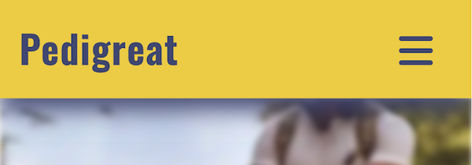

# Pedigreat
Pedigreat is a fictional brand name, which occurred to me when I was contemplating on the project. Googling this brandname gives no exact matches save one in Nigeria that is related to construction development. 

In this project the Pedigreat is an imaginary small-scale business solution in canine and pet-sitting service sector. It teams up experienced dog-lovers who have turned their passion for dogs into a career.    
In order to facilitate boarding part of the business the Pedigreat develops a net of local house owners willing to provide a second-home boarding for Pedigreat clients. The business is based in Berkshire, UK, known for its exceptional walking paths, pet-dedicated playgrounds and amazing meadows. 

In contrast to the existing Uber-like large nets of amateur pet-sitters or big companies blanketing vast territories, Pedigreat position themselves as serving Berkshire communities only, targeting local pet owners. Pedigreat challenges to exercise individual approach policy equipped with in-depth knowledge of local landscapes, resources and lifestyles. Pedigreat personnel stress that they don't sell hours, they rather sell emotions and passion for their furry clientele. 

To facilitate the main business objectives the Pedigreat team has launched a front-end web-site as a first stage of its further development.   
The site can be accessed at the following link  [Pedigreat Web-Site](https://mykola-ci.github.io/pedigreat/index.html)


--------
## User Stories
### First-time Users:
* _As a first-time user_, I want to easily understand the services offered by the pet-sitting website so that I can decide if it meets my needs.
* _As a first-time user_, I want to see testimonials from other pet owners who have used the pet-sitting service so that I can trust the quality of the service.
### Returning Users:
* _As a returning user_, I want to quickly access my account and view my pet-sitting bookings so that I can manage my reservations.
* _As a returning user_, I want to receive notifications about upcoming pet-sitting appointments so that I can prepare my pet and coordinate with the pet sitter.
### Frequent Users:
* _As a frequent user_, I want to earn rewards or discounts for using the pet-sitting service regularly so that I feel valued as a loyal customer.
* _As a frequent user_, I want to have a personalized experience on the website, such as seeing my favorite pet sitters or tailored service recommendations, so that I can quickly find and book the services I need.
### As a Pet Owner In General
* _As a pet owner_, I want to be able to easily find and book a pet sitter so that my pet is cared for when I am away.
* _As a pet owner_, I want to be able to read reviews about pet sitters so that I can choose a sitter I trust.
* _As a pet owner_, I want to be able to communicate with the pet sitter about my pet's needs so they are properly cared for.
* _As a pet owner_, I want to be able to pay conveniently and securely so I don't have to worry about payments.
_________
### Comments On User Stories
Technically the web-site is supposed to employ html & css tools only at the first stage of its development. The business model is adjusted to provide its functionality without undertaking complex back-end software that would manage the automation of scheduling, booking, billing, chatbot etc. That is why the business model and eventually its web-site assumes, at least for now, human-to-human contacts only when making appointments and booking services.

Yet the registration form will appear on one of the pages because Pedigreat offers promotions and cross-promotions, as well as email newsletters for the registered clients. Many of users' wants can be met in the newsletter communication and a relevant event marketing.

## Global functionality and navigation
The first user's hit will be the landing page and the banner. It is equipped with 
* Header with logo and navigation bar 
* Main Slogan followed by the button "Book Now" and the Themed Banner at the Background  

See the site navigation scheme in pdf: [Site Navigation Scheme](documentation/navigation-pedigreat.pdf)


Navigation is provided by the following buttons within the navigation bar:
* Home (Landing Page)
* Gallery (Photo gallery)
* Services (description of Services and price cards)
* Contacts: 
    - Contact details for booking and any communication 
    - Invitation to join Community and Loyalty program

The 'Home' Page contains a button-link to the 'Contacts' Page.

   

'Home' Page also contains Learn More Links that lead to the Services Page

   

The 'Contacts' Page contains the Invitation to fill out the Form and a Button encouraging to jump to the "Customer Registration Form".

   


Once the Form has been submitted User will get into the 'Response' Page as shown in the Site Mapping diagram above.

## Existing Features
The page is divided onto 3 global sections: Header, Main and Footer.   
The Main section of the Front page is divided onto 4 sections: Banner section, About Us, Services and Testimonials

### Header and Navigation Bar
The header takes a fixed position at the top of the screen.  
The header contains a clickable Logo Pedigreat, which leads User to the home page. The only hover effect for Logo __Pedigreat__ is a cursor-pointer transformation with no hover effects. The header also takes on-board the navigation menu realized in 2 basic forms: for small and for larger screens above 765px.

The following visual is a presentation of how header looks on tablet-size screens. There are buttons for the menu items which change the lighting pattern on hover. 


The 'hover' effect in the form of animated lighting pattern delivered by means of css shadow effects:
~~~

  .nav-menu>li {
    background: #f2cb05;
    box-shadow: -20px 20px 55px #a98e04,
      20px -20px 55px #ffff07;
  }

  .nav-menu>li:hover {
    background: linear-gradient(315deg, #dab705, #ffd905);
    box-shadow: -45px -45px 64px #8a7403,
      45px 45px 64px #ffff07;
  }

~~~

* 

The following visual is a presentation of how header looks on mobile-size screens with a conventional Burger Icon. 

* 

With the drop-down menu:

* 

Where 2 basic effects were adopted for the site: 
- drop-down menu transition 1sec ease-in-out
~~~
nav {
  transition: opacity 1s ease-in-out, max-height 1s ease-in-out;
}
~~~
- rotation of the burger icon 90º on touch
~~~
#nav-toggle:checked~.nav-toggle--label {
  transform: rotate(90deg)
}
~~~

* 

### Banner Section on the front page
The Banner on the front Page is arranged as a '::before' pseudo-class element in order to gain control over the background image opacity and filters without affecting the properties of the text box elements.   

```
  .banner-landing::before {
  content: "";
  background: url() no-repeat center center/cover;
  position: absolute;
  top: 0;
  left: 0;
  width: 100%;
  height: 100%;
  z-index: -1;
  filter: blur(2px) opacity(100%);
}
```
At the same time the text slogan has the background of its own to provide for the required contrast, its opacity helping retain consistency throughout the major banner 

  

The banner itself takes about 75% of the viewport height just enough to reveal a part of the next section - About Us.

### About Us and Services sections on the front page
About Us section tells User a few words about the Pedigreat team and its dedication, which is followed by the brief descriptions of 4 distinct types of services in offer.
* The About Us block consists of h3 heading, 2 text blocks and the image of collage portraits photos.
* The Service Descriptions block consists of 4 text cards with elegant curvy borders and smooth shadowing.
Both sections as well as the following Testimonials section are made coherent with the small left and right margins. Technically, this is attained by means of width 95% of their parent, max-width 400px (for responsive design at larger widths) and flex-centered layout.  

   

### Testimonials section on the front page
This section is featured with 2 testimonials, which organized 
* as 2 cards with the photo of a pet-owner, name, occupation and the story
* each placed in a container with a thin border and smooth shadowing
* images are placed at the top left with the properties 
  - float: left and 
  - width: min(20%, 100px) 

  

### Footer
Footer is the global element which is repeated across all the pages in the similar manner as Header.
Unlike Header its position is not fixed, it is pushed down by flex-property of the Main section: flex: 1 0 auto;.

The Footer contains:
* Address block
* 4 Social media icons, which change color on focus


The social media icons change color on hover:


### Secondary banner and the other pages layout
Gallery, Services and Contacts pages have a common layout scheme, which differs from that of the front page. While the front page is dominated by the primary banner and the slogan, the other pages feature:
* secondary banner that takes up about 25% of the viewport height (25vh) and has a fixed property to remain still when content is scrolling

```width: 100%;  
  height: 25vh;  
  position: relative;  
  z-index: 1;
  background-image: url();
  background-attachment: fixed;
  background-position: center;
  background-repeat: no-repeat;
  background-size: cover;
  filter: brightness(50%) hue-rotate(-20deg);
  ```


* the content block/container that is shifted up by 15vh partly overlapping the secondary banner
  - the shift is performed by means of transform property ``transform: translateY(-15vh)``
* the width of the content container is set to 90%  


### Gallery Page

This common element in almost every site is organized in simple and nice masonry style. Live and dynamic view without gaps and borders gives a touch of reality.  
Photos are laid out with a 'column' property.
* default one column for mobiles
* column-count: 2 for the screens larger than 765px
* column-count: 3 for the screens larger than 1020px

The screens with 2 or 3 columns are featured with the additional yellow background from the adopted color scheme. This feature is applied in order to rectify suspended and unfinished graphics of the bottom part of the masonry.


### Services Page

Besides Secondary Banner the Services page contains
* 4 price cards with short and explicit description of the service
* Notes to User about Pedigreat personnel and trainers

Features include:
* Icons inside the price cards - with clip-path feature

~~~
/* Shape services icons */
.services--cards--content img {
  width: clamp(60px, 30%, 80px);
  clip-path: polygon(0% 0%, 75% 0%, 100% 50%, 75% 100%, 0% 100%);
}

.clip-path-shadow {
  filter: drop-shadow(0px 2px 5px var(--COLOR-4));
  text-align: center;
}
~~~


* Standard bullets replaced by Puppy-Dog-face icons for the unordered lists of the Notes section 

~~~
.ul-special-style {
  list-style: none;
  padding: 0;
  margin: 0;
  text-align: left;
}

.ul-special-style li {
  padding-top: 0.3rem;
  text-indent: -1rem;
}

.ul-special-style li::before {
  content: "🐶 ";
  padding-left: max(0.8rem, 4vw);
}

.ul-special-style span {
  position: relative;
  left: 0.8rem
}
~~~


### Contacts Page

The Contacts Page contains 2 sections:
* Contact details which are not automated at this stage of development and include invitation to
  - dial a phone number, 
  - send message to email, 
  - text in WhatsApp.

* Invitation card encouraging Users to become a privileged customer
  - benefits are compiled in an unordered list with puppy-dog bullets 
  - the card is equipped with the button link to the Customer Registration Form

The Invitation card features an 'inset shadow' ``box-shadow: inset 0px 0px 13px 12px rgba(0, 0, 0, 0.1);``


### Customer Registration Form

This page is accessible if User opts to become a privileged customer and hits the 'Go On Register Now' button on the Contacts page.
User is encouraged than to fill out the form


This form features a focus-within property that results in changing font size and color of the input label.

~~~
.customer-registration--block>div:focus-within label {
  color: rgb(51, 51, 160);
  font-size: 150%;
}
~~~


### Response Page
Nothing fancy on this page "to say nothing of the dog" (citation as made famous by Jerome K. Jerome in his Three Men In a Boat).\
The page features two twin dogs with a welcoming banner. 

See for yourself [Pedigreat Web-Site - Response Page](https://mykola-ci.github.io/pedigreat/response.html)


  
### Summary of Responsive Tools Employed

#### __General Media Queries__
>_@media screen and (min-width: 765px)_

This is the major query that provides for the transition from mobile to tablet devices.  
Summary of the query as we go from small to larger screens:
- Toggle of navigation bar from drop-down menu to linear menu form
- Front page: transformation of About Us section to horizontal 3-column view: photo + 2 text columns
- Front page: transformation of Service cards layout to 2 rows x 2 columns
- Front page: transformation of Testimonials to 2 blocks in one row
- Footer:  toggle of column view for Pedigreat address over social media icons to a one-liner
- Gallery page: one column to two column photo gallery 
- Services page: 
  - Price-cards. Changing flex from column to row view with flex-wrap property set to 'wrap'.\
The 1-column view changes to '2-column over 2-rows' view from 930px+ screens due to wrap property.
  - Notes blocks. The 'Pet-care personnel' unordered list changes from 4 list items in 1 column to '2 column over 2 row' view.
- Contact page: 3 communication lines of contacts with icons set from column to row view.
- Customer-form page: Fieldset items (checkboxes and radio buttons) change from column to ``flex-wrap: wrap`` layout.     

>_@media screen and (min-width: 1020px)_

Summary of the query:
- Front page: adjust the gap between service cards
- Front page: change limitation on characters for service cards to stay within 2 column layout.   
`` max-width: 45ch;``
- Gallery page: transition from 2 columns to 3 column masonry of photos.  
``column-count: 3;``
- Registration-form page: setting the form to 2 column view by adjusting flex properties.

>_@media screen and (min-width: 1600px)_

Summary of the query:
- Services Page: ensure all 4 price cards lays in 1 row for all screens by setting flex-wrap property to nowrap value.
- Services Page: change 2 blocks of notes, namely Pet_care personnel and Trainers, from column layout to the horizontal, row layout. 

#### __Special Media Queries__

>_@media screen and (min-width: 380px) and (max-width: 1020px)_ 

* Registration form.\
Trigger padding for the input fields to increase as from smaller screens (380px) to the point where the form changes its layout (1020px) from 1 column to 2 columns.   

>_@media screen and (min-width: 1380px) and (max-width: 1600px)_

* Services Page.\
Manages price cards to remain in 2 x 2 layout in (4 cards in 2 rows).
The parent container is forced to smaller width in order to prevent from flex 'wrap' property to exercise undesirable layout of 3 cards in 1 row and only 1 card in the second row.\
The effect becomes unnecessary at the point of 1600px when the cards must be laid out all 4 in 1 row.

 ~~~
  .services--cards {
    max-width: 1000px;
    gap: 2rem
  }
  ~~~
 
>_@media only screen and (max-width: 950px) and (max-height: 500px) and (orientation: landscape)_

* Manages layout of the front page banner and the slogan.\
The tests on mobiles revealed the problem of text overflow in landscape mode. In addition, the banner was not observable in the screen in its entirety.\
The reason: responsive text sizes as a function from viewport width.\
The solution: match and set fixed font-sizes for the specific range of screens and orientation mode.  

#### __Non-media tools__

* _Clamp function_
  - Set for all fonts sizes using the following selectors globally: h2,h3,h4,h5,p,label,legend. 
  - Set for font-sizes locally for inputs, buttons, links.
  - Set for the size of social media icons inside the footer.
  - Applied to width of price cards on service page.
  - Applied to padding for the Notes items on the service page.
  - Applied to padding-left for address item inside footer for the screens above 760px.

* _Maximum of 2 values in combination with viewport units_
  - Applied to the main banner height to grow with screen height and to prevent from overflow in landscape mode. ``height: max(320px, 75vh);`` 
  - Applied to the left padding of the price cards content to expand with the viewport size.

~~~
.services-details h2 {
  padding: 2rem max(0.5rem, 5vw);
  text-align: center;
}
~~~

~~~
.services--cards--content {
  max-width: 400px;
  padding: 1rem max(0.5rem, 2vw);
}
~~~


