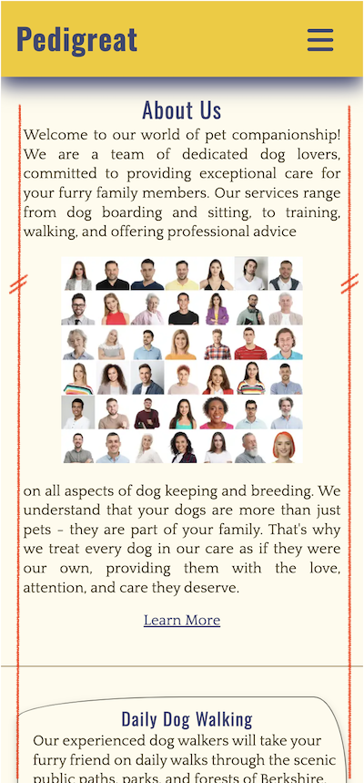

# Pedigreat
Pedigreat is a fictional brand name, which occurred to me when I was contemplating on the project. Googling this brandname gives no exact matches save one in Nigeria that is related to construction development. 

In this project the Pedigreat is an imaginary small-scale business solution in canine and pet-sitting service sector. It teams up experienced dog-lovers who have turned their passion for dogs into a career.    
In order to facilitate boarding part of the business the Pedigreat develops a net of local house owners willing to provide a second-home boarding for Pedigreat clients. The business is based in Berkshire, UK, known for its exceptional walking paths, pet-dedicated playgrounds and amazing meadows. 

In contrast to the existing Uber-like large nets of amateur pet-sitters or big companies blanketing vast territories, Pedigreat position themselves as serving Berkshire communities only, targeting local pet owners. Pedigreat challenges to exercise individual approach policy equipped with in-depth knowledge of local landscapes, resources and lifestyles. Pedigreat personnel stress that they don't sell hours, they rather sell emotions and passion for their furry clientele. 

To facilitate the main business objectives the Pedigreat team has launched a front-end web-site as a first stage of its further development.   
The site can be accessed at the following link  [Pedigreat Web-Site](https://mykola-ci.github.io/pedigreat/index.html)

--------
## User Stories 
### First-time Users:
* _As a first-time user_, I want to easily understand the services offered by the pet-sitting website so that I can decide if it meets my needs.
* _As a first-time user_, I want to see testimonials from other pet owners who have used the pet-sitting service so that I can trust the quality of the service.
### Returning Users:
* _As a returning user_, I want to quickly access my account and view my pet-sitting bookings so that I can manage my reservations.
* _As a returning user_, I want to receive notifications about upcoming pet-sitting appointments so that I can prepare my pet and coordinate with the pet sitter.\
_Note_: These are __future user stories__, [refer to the Features Left to Implement](#features-left-to-implement).   
Existing features assume person-to-person contacts and direct messaging.  
### Frequent Users:
* _As a frequent user_, I want to earn rewards or discounts for using the pet-sitting service regularly so that I feel valued as a loyal customer.
* _As a frequent user_, I want to have a personalized experience on the website, such as seeing my favorite pet sitters or tailored service recommendations, so that I can quickly find and book the services I need.
_Note_: Rewards, discounts and promotions are exercised at this stage through the newsletter and direct messages once the User fills out the existing Registration Form.\
For the next development [refer to the Features Left to Implement](#features-left-to-implement) 
### As a Pet Owner In General
* _As a pet owner_, I want to be able to easily find and book a pet sitter so that my pet is cared for when I am away.
* _As a pet owner_, I want to be able to read reviews about pet sitters so that I can choose a sitter I trust.
* _As a pet owner_, I want to be able to communicate with the pet sitter about my pet's needs so they are properly cared for.
* _As a pet owner_, I want to be able to pay conveniently and securely so I don't have to worry about payments.\
_Note_: All communications with pet-sitters and administration and the related user stories are currently accomplished by e-mail, texting or phone calls.\
For further development please [refer to the Features Left to Implement](#features-left-to-implement)    
_________
### Comments On User Stories
Technically the web-site is supposed to employ html & css tools only at the first stage of its development. The business model is adjusted to provide its functionality without undertaking complex back-end software that would manage the automation of scheduling, booking, billing, chatbot etc. That is why the business model and eventually its web-site assumes, at least for now, person-to-person contacts only when making appointments and booking services.

Yet the registration form will appear on one of the pages because Pedigreat offers promotions and cross-promotions, as well as email newsletters for the registered clients. Many of users' wants can be met in the newsletter communication and a relevant event marketing.

## Existing Features
There are 6 pages in total at present:
1. Home 
2. Gallery 
3. Services 
4. Contacts 
5. Customer Registration Form
6. Response

Each page is divided onto 3 global sections: Header, Main Content and Footer.

### Global functionality and navigation
The first User's hit will be the Landing page and the Banner. It is equipped with 
* Header with logo and navigation bar 
* Main Slogan followed by the button "Book Now" and the Themed Banner at the Background  

See the site navigation scheme in pdf: [Site Navigation Scheme](documentation/wireframes/navigation-pedigreat.pdf)

Navigation is provided by the following menu within the navigation bar:
* Home (Takes User to the Home or Landing Page)
* Gallery (Takes User to the Photo gallery)
* Services (Takes User to the description of Services and price cards)
* Contacts (Takes User to the Contact Page) 

The 'Home' Page contains a button-link to the 'Contacts' Page as an additional tool to get to the Contact Page.

   

Within the About Us and Service descriptions sections 'Home' Page also contains Learn More Links that lead to the Services Page

   

The 'Contacts' Page contains the Invitation to fill out the Form and a Button encouraging to jump to the Customer registration Form.

   

If User opts to fill out the registration form he or she hits the Button and gets to [Customer Registration Form](#customer-registration-form).

Once the Form is completed User will get to a [Response Page](#response-page).

### Header and Navigation Bar

* The Header takes a fixed position at the top of the screen and available through all 6 pages.  
* The Header contains a clickable Logo Pedigreat, which leads User to the Home page from every other page.
* The Header includes the menu of links to 4 pages (Home, Gallery, Services and Contacts). 
  - _Note_: The access to the Customer Registration Form and the Response Page is granted only in case User opts to register in Pedigreat databases.
* The Header and Navigation Bar is fully responsive so User can navigate easily across all devices:
  - layout for Tablets, Laptops and Desktops is arranged in the form of the lighted buttons  

Which change the lighting pattern on hover 

*
  - layout for Mobiles goes with a conventional Burger Icon 

and the drop-down menu:

Burger icon rotating  on touch:

* Such organization of the Header and Navigation Bar provides for smooth User's navigation from page to page without undertaking backward sequences. 

### Home page
#### Landing Page and Primary Banner 
The Banner Section becomes a __Landing page__ for the User being the first visible part of the Home Page. 
The Banner Section or the Landing Page consist of: 
* a photograph of pet-sitters and multiple dog-walking suggesting User the type of activities
* a Text Slogan overlaid in foreground gives User information of the type of service offered and a location it is applicable to
* a Link-button "__Book Now__" encouraging User to proceed with booking  
 

  

 

The banner itself takes about 75% of the viewport height just enough to reveal a part of the next section __About Us__.  
User can see that scrolling further down is going to provide more information.

#### About Us and Services sections on the Home page
* __About Us__ section tells User a few words about the Pedigreat team, its professional knowledge and dedication. The section consists of  
  * 2 text blocks and 
  * the collage of portrait photos of the Pedigreat personnel.

The About Us section is followed by the brief descriptions of 4 distinct types of services in offer.
* User will understand the scope of services to differentiate one from another
  * Daily Dog Walking
  * Vacation Home Visits
  * Second Home Boarding
  * Dog Training Sessions

* User will be encouraged to learn more by hitting the Learn More links

 

   

#### Testimonials section on the Home page
This section is featured with 2 testimonials organized as cards. User will see and get familiar with
* the photo of a pet-owner, 
* name,
* occupation 
* and the pet-owner's story

 

  

### Footer
The Footer is a global element which is repeated across all the pages in the similar manner as the Header.
Unlike the Header its position is not fixed, it is pushed down by Main Content of each page.

User can see:
* Address of Pedigreat Pets company
* 4 Social media icons that serve as clickable links to the respective media blogs supported by Pedigreat

The social media icons change color on hover:

### Gallery Page
User can see
* that the Pedigreat has a wide array of clients,
* pet-sitters and pet-owners indulged with their furry friends and beaming with emotions,  
* breathtaking local landscapes showing possible playgrounds.

This common and valuable element in almost every site is organized in simple and nice masonry style.   
Live and dynamic view without gaps and borders gives a touch of reality and dynamic nature.    
Photos are laid out:
* in one column for mobiles
* 2 columns for the screens larger than 765px
* 3 columns for the screens larger than 1020px

The screens with 2 or 3 columns are featured with the additional yellow background from the adopted color scheme.   
This feature is applied in order to rectify suspended and unfinished graphics of the bottom part of the masonry.

### Services Page

The Services page provides useful and practical information for User.

* The main elements of the page are 4 price cards with
   * vivid and cute Icons, as a supporting visual for the specific service, 
   * detail of the service described in simple and straightforward style, that will aid to Users's knowledge before he or she picks and books,
   * a button-link to the Contacts Page to make an appointment or booking,
   * and the most important for User - the indicative price at a basic scope of service. 

* Beneath the Price cards User can find Notes about Pedigreat personnel and trainers, that shows
   * professional qualities of the Pedigreat administration in selecting personnel
   * care for reputation by providing high safety and security standards for their Clients

### Contacts Page
This is a go-to-action Page. User will be given details of contact and channels of communication.

The Contacts Page contains 2 sections:
* Contact details which are not automated at this stage of development and include invitation to
  - dial a phone number, 
  - send message to email, 
  - text in WhatsApp.

* Invitation card encouraging Users to become a privileged customer
  - benefits are explicit and attractive for User 
  - the card is equipped with the button link to the Customer Registration Form

### Customer Registration Form
[Back to Existing Features](#existing-features)

This page is accessible if User opts to become a privileged customer and hits the 'Go On Register Now' button on the Contacts page.
User is encouraged than to fill out the form

This form features change of font size and color of the input border and label when in focus.

### Response Page
[Back to Existing Features](#existing-features)

Nothing fancy on this page "to say nothing of the dog" (citation as made famous by Jerome K. Jerome in his Three Men In a Boat).\
The page features two twin dogs with a welcoming banner for a User who took time to fill out the form. 

See for yourself [Pedigreat Web-Site - Response Page](https://mykola-ci.github.io/pedigreat/response.html)

## Features Left to Implement
[Back to User Stories](#user-stories)

__Customer Portal.__\
This feature will allow customers 
* to view and manage their account information, 
* track their orders, 
* and submit support tickets.  

It will provide a secure and open forum for collaboration, enabling customers to access key metrics, support requests, and other relevant information.  
The portal will also offer self-service options, allowing customers to resolve their own queries and reducing the need for real-time help via chat or calls.

__"Tips & Paws" Blog Page.__\
This page will host various articles and tips from professionals. It will serve as a platform for sharing valuable information and insights about pet care, pet-sitting services, and other related topics.

__Automated Scheduling for Appointments.__\
This feature will automate the process of scheduling appointments, making it easier for customers to book services at their convenience.\
It will also help in managing the availability of pet sitters and ensuring efficient allocation of resources.

__Automated Booking of Specific Service.__\
This feature will allow customers to book specific services directly from the website. It will streamline the booking process, making it more efficient and user-friendly.

__Electronic Payment__\
This feature will enable customers to make payments for services electronically, providing a secure and convenient payment method. It will support various payment options to cater to the preferences of different customers.

__ChatBot and FAQ Page__\
The ChatBot will provide instant responses to common queries, enhancing customer service efficiency. The FAQ page will host answers to frequently asked questions, serving as a self-help resource for customers.

## Technologies Used

- [HTML](https://developer.mozilla.org/en-US/docs/Web/HTML) - coding the structure and content of the site pages.
- [CSS](https://developer.mozilla.org/en-US/docs/Web/css) - adding and creating styles to the site elements.
- [CSS Flexbox](https://developer.mozilla.org/en-US/docs/Learn/CSS/CSS_layout/Flexbox) - one of the major tools to arrange layouts on the pages.
- [CSS roots](https://developer.mozilla.org/en-US/docs/Web/CSS/:root) - declaring global CSS variables and apply them across the project. 
- [Balsamiq](https://balsamiq.com/) - was used to make wire-frames for the website.
- [VSCode](https://code.visualstudio.com/) - IDE for the project, the main workframe to write and edit code.
- [Git](https://git-scm.com/) -  the version control system and tracking changes of html & css for the Project.
- [GitHub](https://github.com/) - hosting the code of the website and for deployment.
- [GIMP](https://www.gimp.org/) - was used to make and resize images for the README file.
- [Chrome Devtools](https://developer.chrome.com/docs/devtools/) - used as the important tool in layouts control, responsiveness check, testing
- [Responsive Viewer](https://chromewebstore.google.com/detail/responsive-viewer/inmopeiepgfljkpkidclfgbgbmfcennb) - a Chrome extension used for testing 

## Design

### Color Palette

The colors adopted for the project Pedigreat were inspired by the trending palette as made public by [Adobe Color](https://color.adobe.com/trends) .\
This palette can be found at [Adobe Trends - Postane palette](https://color.adobe.com/search?q=postane)

Further search on the palette origin and its authors has lead to the following site [Fol Studio Turkey](https://fol.com.tr/works/postane/).\
According to the authors, Fol Studio, they created the identity of Postane, which is a place in Istanbul that aims to host social, environmental and urban impact-oriented works and joint cultural productions. The place is located in the historical building known as the British Post Office [Postane](www.postane.co).

The Palette for the Pedigreat project was augmented with the color 4 from original Fol Studio Palette and the  Color 5  adjusted to provide for the contrast of font color.\
The Palette has a unique symbiosis of traditional and somewhat archaic warm tones with a modern urban touch, which is so appropriate to the Berkshire moods and lifestyles nowadays.      

| Color Type |   Used for  |
| -------- | -------- |
| Color 1   | For the Headings h1, h2, h3, h4, h5 |
| Color 2   | For the Background Color of Gallery and Drop Down Menu block |
| Color 3  |  For the Background Color of the Header and Navigation Bar |
| Color 4 | For the Background Color of the Footer |
| Color 5 | For the Font Color of the entire Body and Input elements |

### Typography

## Testing

For the testing documentation and descriptions please refer to [TESTING.md](TESTING.md)

## Deployment

### Deployment to GitHub Pages

- This site was deployed to GitHub pages. Follow the steps below to deploy: 
  - In the [GitHub repository](https://github.com/Mykola-CI/pedigreat), navigate to the Settings tab 
  - From the source section drop-down menu, select the __Main__ Branch, then click "Save".
  - The page will be automatically refreshed with a detailed ribbon display to indicate the successful deployment.

The live link to the Pedigreat site can be found [here](https://mykola-ci.github.io/pedigreat)

### Local Deployment

In order to make a local copy of this project, you can clone it.
In your IDE Terminal, type the following command to clone the repository:

- ``git clone https://github.com/Mykola-CI/pedigreat.git``

- Alternatively, if you use Gitpod, you can [click here](https://gitpod.io/#https://github.com/Mykola-CI/pedigreat), which will start the Gitpod workspace for you.

## Credits

### Content
The content of this site was built as a result of on-line study of:
* business models in pet-sitting and pet-boarding sector
* on-line resources of existing businesses

Inspiration for content, design and layouts was taken mostly from the following web-resources:
* [Paula's Pet-Sitting](https://paulaspetsitting.com) 
* [Animal Shelter](https://iuliiakonovalova.github.io/animal_shelter)
* [Capterra UK](https://www.capterra.co.uk) 
* [DoggyDayCare](https://www.doggydaycare.uk.com)
* [Rover](https://www.rover.com/uk/)
* [Mindful Paws](https://mindfulpaws.co.uk/)
* [Pawshake](https://mindfulpaws.co.uk/)
 and many more...

Regarding inspiration for Color Palette please go to [Design](#design)  

### Media

The images for the Pedigreat Web-Site were taken from [Unsplash](https://unsplash.com/) and [Deposit Photos](https://depositphotos.com/home.html).\
The main banner image was taken from [iStock](https://www.istockphoto.com/)

* __Home Page__
   - [Main Banner](https://www.istockphoto.com/photo/group-of-dog-walkers-working-together-gm1345672917-423673247)
   - [Collage of Pedigreat Personnel](https://depositphotos.com/photo/collage-photos-happy-attractive-people-white-background-576061626.html)
   - [Testimonial Hero 1](https://unsplash.com/photos/woman-wearing-brown-and-black-plaid-dress-shirt-smiling-white-taking-picture-2oLBwyl80QY) 
   - [Testimonial Hero 2](https://unsplash.com/photos/bearded-man-taking-a-selfie-kMJp7620W6U)

* __Gallery__
  - [Photo 1](https://depositphotos.com/photo/couple-walking-with-dogs-46673591.html)
  - [Photo 2](https://depositphotos.com/photo/little-boy-playing-dogs-park-222882292.html)
  - Photo 3 - kindly granted by a friend
  - [Photo 4](https://unsplash.com/photos/group-of-people-standing-on-green-grass-field-during-daytime-SAwxJ8PHY3Q)
  - [Photo 5](https://unsplash.com/photos/woman-carrying-black-french-bulldog-qQfYkkzjunc)
  - [Photo 6](https://unsplash.com/photos/smiling-woman-hugging-puppy-CXQgs12wFHc)
  - [Photo 7](https://depositphotos.com/photo/two-womans-dogs-rest-park-223675362.html)
  - [Photo 8](https://unsplash.com/photos/close-up-photography-of-blue-australian-shepherd-puppy-sitting-on-green-grass-TTx6xTXWKHI)
  - Photo 9 - kindly granted by a friend
  - [Photo 10](https://unsplash.com/photos/man-sitting-beside-black-dog-tk5LWGNiWVs)
  - [Photo 11](https://depositphotos.com/photo/dogs-of-different-race-playing-on-a-green-lawn-53094309.html) 
  - [Photo 12](https://unsplash.com/photos/woman-carrying-dog-while-standing-Y6EIP03u_wY)
  - [Photo 13](https://unsplash.com/photos/a-woman-sitting-in-the-grass-with-her-dog-91zgFEWBkmc)
  - [Photo 14](https://unsplash.com/photos/man-in-gray-sweater-sitting-beside-black-and-white-border-collie-1wYswsLHXII)
  - Photo 15 - kindly granted by a friend
  - [Photo 16](https://unsplash.com/photos/woman-carrying-long-coated-white-dog-near-green-leafed-plants-HNCX1RT1qRk)

